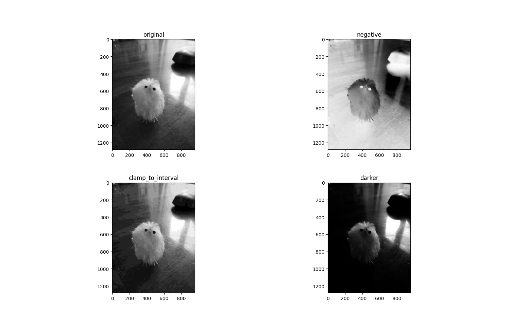
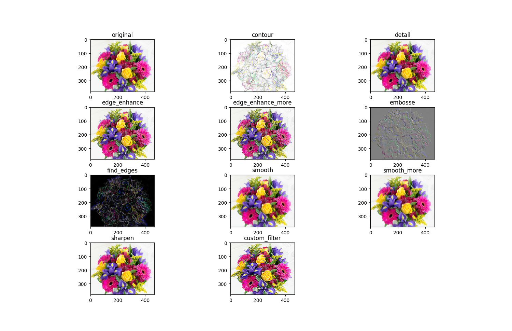
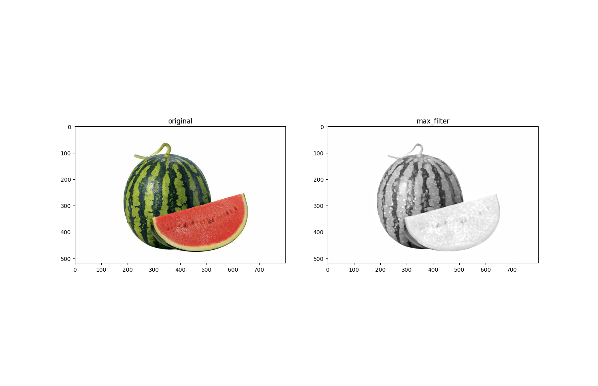
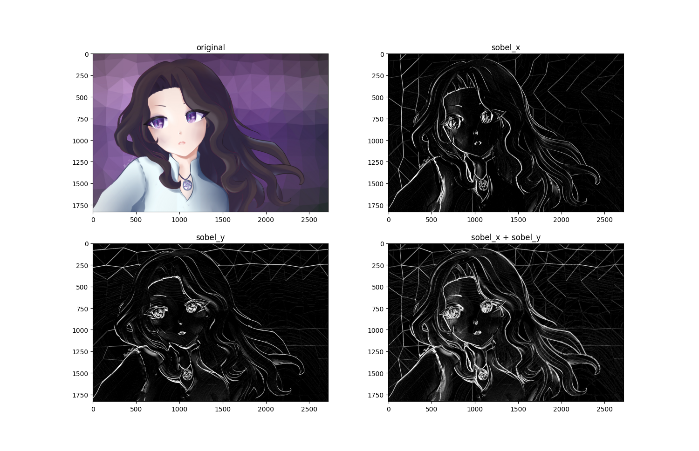

#  Computer Graphics
Create and activate the virtual environment:

    python3 -m venv ./venv
    source ./venv/bin/activate
Install requirements:

    pip3 install -r requirements.txt

Run the demo script:

    bash show.sh

## Result

